<p align="center">
<a href="https://pkg.go.dev/github.com/erfanmomeniii/colorful?tab=doc"target="_blank">
    
</a>


</p>

# colorful

<i>colorful</i> is a lightweight package for rendering colorful text in terminal with Go . You can use this instead of **fmt**
package for having many features. For seeing usages check [this](https://pkg.go.dev/github.com/erfanmomeniii/colorful).

# Documentation

## Install

```bash
go get github.com/erfanmomeniii/colorful/v2
```   

Next, include it in your application:

```bash
import "github.com/erfanmomeniii/colorful/v2"
``` 

## Quick Start

The following example demonstrates how to print text in desired format and color:

```go
package main

import (
	"github.com/erfanmomeniii/colorful/v2"
)

func main() {
	colorful.WithColor(colorful.RedColor).
		WithBackgroundColor(colorful.BlueBackgroundColor).
		Println("RedColorBlueBackground")

	colorful.WithColor(colorful.GreenColor).
		Println("GreenColor")

	colorful.WithBackgroundColor(colorful.YellowBackgroundColor).
		Println("YellowBackground")
}

```

### Supported Colors

|                                                                 |
|:----------------------------------------------------------------|
| 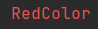                     |
| 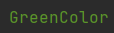                 |
|                |
| 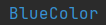                   |
| 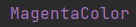             |
| 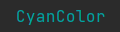                   |
| 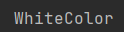                 | 
| 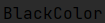                 |
| 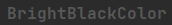     |
| 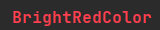         |
| 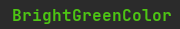     |
| 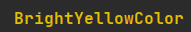   |
| 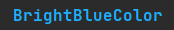       |
| 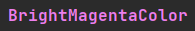 |
| 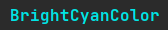       |
| 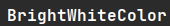     |

> You can use the following color codes :
>
>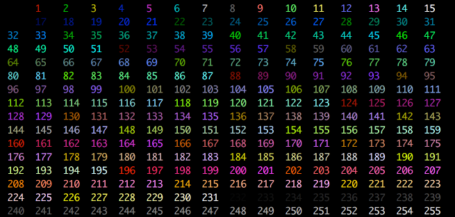

### Supported Background Colors

|                                                                      |
|:---------------------------------------------------------------------| 
| 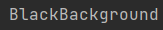                 |
| 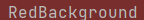                     |
|                  |
|                |
|                    |
|              |
|                    |
|                  |
| 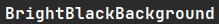     |
| 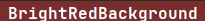         |
|      |
|    |
|        |
|  |
|        |
| 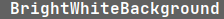     |

> You can use the following background codes :
>
>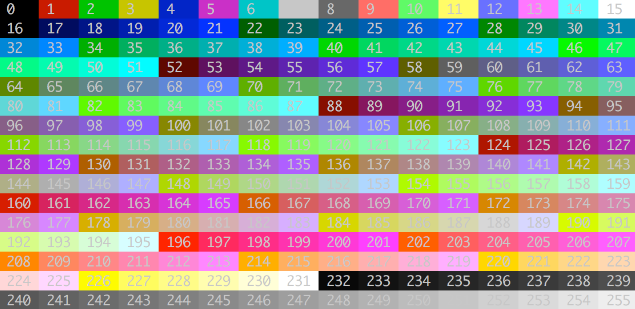

## Contributing

Pull requests are welcome. For changes, please open an issue first to discuss what you would like to change. Please make
sure to update tests as appropriate.
