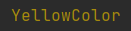
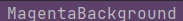

# colorful

colorful is a lightweight package for rendering colorful text in terminal with Go you can use this instead of **fmt** package for having many features.


# Documentation
## Install
```bash
go get github.com/ErfanMomeniii/colorful
```   
Next, include it in your application:
```bash
import "github.com/ErfanMomeniii/colorful"
``` 
### Supported Colors

|                                                                 |
|:----------------------------------------------------------------|
|                      |
|                  |
|                |
|                    |
|              |
|                    |
|                  | 
|                  |
|      |
|          |
|      |
|    |
|        |
|  |
|        |
|      |
>You can also use the following color codes :
>
>

### Supported Background Colors
|                                                                      |
|:---------------------------------------------------------------------| 
|                  |
|                      |
|                  |
|                |
|                    |
|              |
|                    |
|                  |
|      |
|          |
|      |
|    |
|        |
|  |
|        |
|      |
>You can also use the following background codes :
>
>

## Quick Start

The following example demonstrates how to print text in desired format and color:
```go
package main

import (
	"github.com/ErfanMomeniii/colorful"
)

func main() {
	colorful.Println(colorful.RedColor, colorful.BlueBackground, 
		"RedColorBlueBackground", colorful.ResetColor)
}

```
:warning: **If you dont use ResetColor**  ,Next time it will be printed with the same color as the one you had been set 

The following example demonstrates how to print text using color and background code:
```go
package main

import (
	"github.com/ErfanMomeniii/colorful"
)

func main() {
	colorful.Println(colorful.GetBackgroundColorFromCode(1), colorful.GetBackgroundColorFromCode(4), 
		"RedColorBlueBackground", colorful.ResetColor)
}

```
## Contributing
Pull requests are welcome. For changes, please open an issue first to discuss what you would like to change.
Please make sure to update tests as appropriate.
